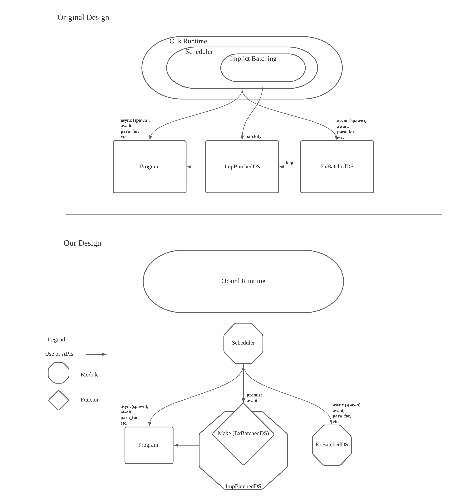

# Domainslibs Fork - Batching support

This fork introduces support for a technique called "batching" which aims to increase data structure throughput of programs. In programs that run with "batching" support, data structure operations can be processed as a logical "batch" instead of atomic operations which reduces synchronization overhead and opens up more opportunities for optimisation. The goal of this work is to provide the scheduling infrastructure for the community to innovate and build new data structures for OCaml that stand to benefit from batching.

The main contributions of our work include:
1. A portable Batcher which makes turning explicitly batched data structures to their implcitly batched versions cheap.
2. A Batcher that allows multiple batched data structures in the same program
3. Investigation of the performance characteristics of implicitly batched data structures

To read more about Batching, this paper introduces the idea https://www.cse.wustl.edu/~kunal/resources/Papers/batcher.pdf

# Preliminary work and test results
These benchmarks were run on an 8-core Intel x86-64 Machine
## Batched Counter
Simulating standard parallel counters against batched counters
```
(Workload: 1_000_000 increment operations)

                     (SEQ)
     num_domains:      1        2        3        4        5        6        7        8   
     batch limit:      ----------------------- 1_000_000 operations ------------------------
     LockCounter:     8286     7701     6772     6253     5545     5081     4644     4631  ops/ms
 LockfreeCounter:     9077     8843    11695    13313    15124    14271    13176    12612  ops/ms

  BatchedCounter:     3892     1069     1369     1685     1606     1996     2048     2102  ops/ms
 BatchedCounterF:     4381     1022     1389     1658     1844     1847     1917     2137  ops/ms
BatchedCounterFF:    10005    12716    11570     7624     6518     6507     6227     6072  ops/ms
```
The batch_limit is configured by adjusing the chunk_size of `parallel_for` which determines the number of tasks grouped together to run asynchronously. A chunk_size of 1 corresponds to 1_000_000 operations spawned.

For standard parallel counters (LockCounter & LockfreeCounter), performance degrades as the number of cores increase. BatchedCounters on the other hand scale better, plateuing around 7 cores.

- BatchedCounter: Disjoint BOP operation, sequential chokepoint to create the "batch"
- BatchedCounterF: No sequential chokepoint from generating the "batch", integrated BOP
- BatchedCounterFF: Use fast and slow path

Turns out, there is a non-obvious "best" batch_limit.
```
`parallel_for` default batch_limit 

                      (SEQ)
     num_domains:       1        2        3        4        5        6        7        8 
     batch limit:       1        16       32       32       32       64       64       64
     LockCounter:     62897     7645    14832    10017     7384     7056     6386     6501  ops/ms
 LockfreeCounter:    243897    19709    15282    14266    12176    11709    11082    14413  ops/ms

  BatchedCounter:      7819     2010     2221     2576     3001     3147     3231     3202  ops/ms
 BatchedCounterF:     10263     1908     2313     2625     3196     3469     3548     3624  ops/ms
BatchedCounterFF:    247949    50976    67594    59559    43409    56082    41665    42976  ops/ms


                     (SEQ)
     num_domains:      1        2        3        4        5        6        7        8
     batch limit:      ------------------------ 4096 operations ------------------------
     LockCounter:    63260     6981    14337    11244     7410     6979     6249     6127  ops/ms
 LockfreeCounter:   217581    22950    16366    16826    14748    13497    15223    14229  ops/ms

  BatchedCounter:     7499     2729     3629     3913     3931     4051     4267     4297  ops/ms
 BatchedCounterF:     9907     3013     3364     4312     4349     4924     5278     5001  ops/ms
BatchedCounterFF:   207989    28541    35540    24778    31145    21180    17896    37833  ops/ms
```
My testing shows that a batch limit of 4096 operations per batch yields the best throughput for this batched counter. However, this "optimal" batch limit is highly dependent on performance of the batched operations as well as the workload of the core program.

### (SEQ) always performs better in both traditional synchronization and batching
1. Traditional synchronization - Overhead due to contention for shared resource dominates parallelism benefits
2. Batching - Overhead of batching dominates the speedup of batching

### (SEQ) performance difference between sections
The large difference in (SEQ) performance between the two sections are due to the number of tasks spawned. In the previous section, 1_000_000 tasks are spawned, causing contention in the scheduling. In the current section, the number of tasks spawned is greatly reduced, at most being 4096 tasks.

### Batching performance analysis
Like the earlier section, Batched counters from 2 -> 8 domains demonstrate mostly steady speedup and then some plateuing towards the end (Some slowdown is also observed). Batched counters are a unique case because the cost of increment or decrement operations are so cheap that the benefits of batching are hard to see. The below experiments are to show how `parallel_prefix_sums` which is the underlying batch operation without implicit batching shows marginal speedup after 5 domains. We also show how inserting delays to exaggerate the performance gain of batching reveals consistent speedup.

```
Performance of par_prefix_sums 10_000_000 ops
    num_domains:      1        2        3        4        5        6        7        8
Par_prefix_sum:     25486    61093    98083   100149    83650   109588   102149    89216  ops/ms

Par_prefix_sum With sleep delay to exaggerate parallelism speedup (100_000 ops with 1ms delay)
   num_domains:      1        2        3        4        5        6        7        8
Par_prefix_sum:      19       38       55       76       94      111      126      146  ops/ms

Implicit batching with sleep delay (100_000 ops with 1ms delay)
   num_domains:      1        2        3        4        5        6        7        8
BatchedCounter:      19       37       54       74       90      107      119      136  ops/ms
```

Implicit Batch size statistics (batch limit 4096)
```
Running ImpBatchCounter Statistics, batch_size = 4096, ops = 10000000

1 -> 3
2 -> 4
3 -> 1
4 -> 1
13 -> 2
28 -> 1
42 -> 1
57 -> 1
83 -> 1
169 -> 1
260 -> 1
573 -> 1
773 -> 1
1064 -> 1
1090 -> 1
1156 -> 1
1290 -> 1
1787 -> 1
2047 -> 1
2810 -> 1
3070 -> 1
3071 -> 3
3072 -> 1
3633 -> 1
3943 -> 1
3958 -> 1
4065 -> 1
4090 -> 1
4091 -> 1
4092 -> 7
4093 -> 41
4094 -> 120
4095 -> 1201
4096 -> 1060

```
## Batched Skip List
Skip-list sequential (No concurrency control) inserts vs batched inserts
```
Initialized: 1 Million elements
Inserts: 100,000 elements

       num_domains:      2        3        4        5        6        7        8
       batch limit:      16       32       32       32       64       64       64
           Seq_ins:     299      284      299      301      298      284      297  ops/ms
    ImpBatched_ins:     346      432      465      563      585      644      627  ops/ms


       num_domains:      2        3        4        5        6        7        8
       batch limit:     ------------------------ 127 operations ------------------------
           Seq_ins:     299      284      299      301      298      284      297  ops/ms
    ImpBatched_ins:     366      513      594      623      660      681      677  ops/ms

```
```
Initialized: 10 Million elements
Inserts: 100,000 elements

        num_domains:      2        3        4        5        6        7        8
        batch limit:     ------------------------ 127 operations ------------------------
            Seq_ins:     137      142      153      153      149      153      149  ops/ms
     ImpBatched_ins:     156      240      260      409      432      423      522  ops/ms

```
BOP performance
```
(batch limit 127)
Performance of parallel insert 1 million preset and 100_000 inserts
num_domains:      1        2        3        4        5        6        7        8
Batch_ins:       236      279      294      303      301      304      309      309  ops/ms

Performance of parallel insert 10 million preset and 100_000 inserts
num_domains:      1        2        3        4        5        6        7        8
Batch_ins:       229      381      494      459      496      647      512      570  ops/ms

Performance of parallel insert (1 million preset, 1 million inserts)
num_domains:      1        2        3        4        5        6        7        8
Batch_ins:       459      730      845      886      896      909      914      924  ops/ms
```
Implicit Batch size statistics (batch limit 127)
```
Running ImpBatchSlist Statistics, batch_size = 127, preset = 1000000, additional inserts = 100000

1 -> 1564
2 -> 12
5 -> 4
6 -> 2
7 -> 6
9 -> 12
10 -> 4
32 -> 4
101 -> 2
126 -> 260
127 -> 1300
```
## Design
In the original design proposed by the authors, support for implicit batching had to be integrated into the runtime scheduler. In OCaml however, schedulers are written as modular library components that wrap programs. This is convenient since it makes the scheduler portable and now we don't need to dive into the internals of the runtime to change them. Furthermore, our design cleanly partitions the batching logic from the scheduler by only using `promise` and `await` API's exposed by the scheduler. This organization makes the Batcher itself modular and also interestingly solves the problem of not being able to have multiple batched data structures in the same program.

We implement a functor that encapsulates implicit batching support. Using this functor which takes an explicitly batched data structure as input, it generates a implicitly batched version of that data structure.

## Notes
There is an interesting trade-off between the number of parallel operations running and the cost of parallelising tasks. It seems like creating huge batches, tests with batches as big as 15,000 does not beat tests with batches of size 60. This trade-off seems to be measured in the chunk_size calculation of the parallel-for algorithm. However, it does not always seem to be the best choice especially because it is dependent on how fast the batched operations run vs the sequential operations. I also suspect that if we can avoid the sequential bottle neck when we pass around the operation array, we may be able to attain more consistent behaviour

# Domainslib - Nested-parallel programming

Domainslib provides support for nested-parallel programming. Domainslib provides async/await mechanism for spawning parallel tasks and awaiting their results. On top of this mechanism, domainslib provides parallel iteration functions. At its core, domainslib has an efficient implementation of work-stealing queue in order to efficiently share tasks with other domains.

Here is a _sequential_ program that computes nth Fibonacci number using recursion:

```ocaml
(* fib.ml *)
let n = try int_of_string Sys.argv.(1) with _ -> 1

let rec fib n = if n < 2 then 1 else fib (n - 1) + fib (n - 2)

let main () =
  let r = fib n in
  Printf.printf "fib(%d) = %d\n%!" n r

let _ = main ()
```

We can parallelise this program using Domainslib:

```ocaml
(* fib_par.ml *)
let num_domains = try int_of_string Sys.argv.(1) with _ -> 1
let n = try int_of_string Sys.argv.(2) with _ -> 1

(* Sequential Fibonacci *)
let rec fib n =
  if n < 2 then 1 else fib (n - 1) + fib (n - 2)

module T = Domainslib.Task

let rec fib_par pool n =
  if n > 20 then begin
    let a = T.async pool (fun _ -> fib_par pool (n-1)) in
    let b = T.async pool (fun _ -> fib_par pool (n-2)) in
    T.await pool a + T.await pool b
  end else
    (* Call sequential Fibonacci if the available work is small *)
    fib n

let main () =
  let pool = T.setup_pool ~num_domains:(num_domains - 1) () in
  let res = T.run pool (fun _ -> fib_par pool n) in
  T.teardown_pool pool;
  Printf.printf "fib(%d) = %d\n" n res

let _ = main ()
```

The parallel program scales nicely compared to the sequential version. The results presented below were obtained on a 2.3 GHz Quad-Core Intel Core i7 MacBook Pro with 4 cores and 8 hardware threads.

```bash
$ hyperfine './fib.exe 42' './fib_par.exe 2 42' \
            './fib_par.exe 4 42' './fib_par.exe 8 42'
Benchmark 1: ./fib.exe 42
  Time (mean ± sd):     1.217 s ±  0.018 s    [User: 1.203 s, System: 0.004 s]
  Range (min … max):    1.202 s …  1.261 s    10 runs

Benchmark 2: ./fib_par.exe 2 42
  Time (mean ± sd):    628.2 ms ±   2.9 ms    [User: 1243.1 ms, System: 4.9 ms]
  Range (min … max):   625.7 ms … 634.5 ms    10 runs

Benchmark 3: ./fib_par.exe 4 42
  Time (mean ± sd):    337.6 ms ±  23.4 ms    [User: 1321.8 ms, System: 8.4 ms]
  Range (min … max):   318.5 ms … 377.6 ms    10 runs

Benchmark 4: ./fib_par.exe 8 42
  Time (mean ± sd):    250.0 ms ±   9.4 ms    [User: 1877.1 ms, System: 12.6 ms]
  Range (min … max):   242.5 ms … 277.3 ms    11 runs

Summary
  './fib_par2.exe 8 42' ran
    1.35 ± 0.11 times faster than './fib_par.exe 4 42'
    2.51 ± 0.10 times faster than './fib_par.exe 2 42'
    4.87 ± 0.20 times faster than './fib.exe 42'
```

More example programs are available [here](https://github.com/ocaml-multicore/domainslib/tree/master/test).

## Installation

You can install this library using `OPAM`.

```bash
$ opam switch create 5.0.0+trunk --repo=default,alpha=git+https://github.com/kit-ty-kate/opam-alpha-repository.git
$ opam install domainslib
```

## Development

If you are interested in hacking on the implementation, then `opam pin` this repository:

```bash
$ opam switch create 5.0.0+trunk --repo=default,alpha=git+https://github.com/kit-ty-kate/opam-alpha-repository.git
$ git clone https://github.com/ocaml-multicore/domainslib
$ cd domainslib
$ opam pin add domainslib file://`pwd`
```
